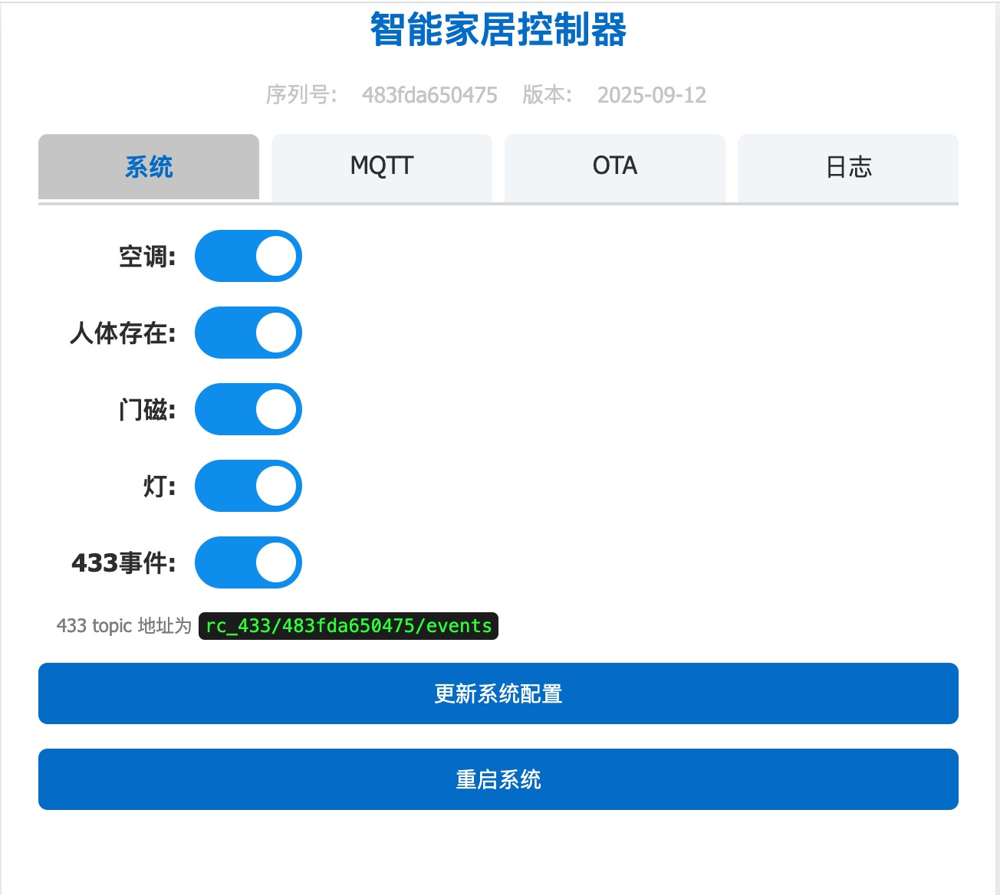

# ESP8266-IR-SmartControl 智能家居控制器

## 项目简介

本项目基于 ESP8266 接入 Home Assistant，旨在实现智能家居控制功能，包括红外空调遥控、门磁传感、灯光控制、存在感应、射频波控制、MQTT 通信、Web 控制界面等。适用于房间自动化、远程控制和状态监测。

## 主要功能

- 红外遥控设备控制
- 门磁传感器检测门的开关状态
- 灯光自动/手动控制
- 人体存在传感器检测
- 射频波设备控制
- MQTT 协议远程通信
- Web Server 提供网页控制界面
- WiFi 配网与联网
- 433 信号发送到 mqtt 可通过 home assistant 自动化处理

## 快速开始

1. ## **硬件准备**：

   - 通过 `hardware/Gerber.zip` 下单 PCB
   - 通过 `hardware/bom.xlsx` 购买电子元件
   - 自行购买 门磁、随意贴、人体感应等传感器
   - 按照 `hardware/` 目录下的电路图组装

   **硬件实物与渲染图展示：**
   .jpg>)
   .jpg>)
   .jpg>)
   .jpg>)
   
   
   
   更多硬件资料见 `hardware/` 目录，包括 3D 打印外壳、原理图、BOM、Gerber 文件等。

   **天线制作说明：**

   - 建议使用 17.3cm 长的网线单根（铜芯线）绕制 433mhz 天线，一端焊接到 PCB 天线焊盘，另一端悬空。

2. **网页控制**：

   - 设备联网后，访问设备 IP 即可打开网页控制界面 控制页面可以选择开启的功能
     
   - 可在 mqtt 或初始化配网页面配置服务器地址密码等
   - 可在 HomeAssistant 自动化处接收 433 事件
     
   - 可在 OTA 页面上传固件升级
   - 可在日志页面看到系统日志和 433 无线设备码
     

3. **Home Assistant 无线电配置**：

   - 本项目通过 MQTT 与 Home Assistant 集成。
   - 可在 Home Assistant 配置页面调整空调型号
   - 可在 Home Assistant 的配置页面添加 433MHz 无线电控制设备，实现远程开关灯、空调、门磁等。

   **Home Assistant 配置页面示例：**
   
   
   

## 贡献

欢迎提交 issue 和 PR 参与项目改进。

## License

MIT
